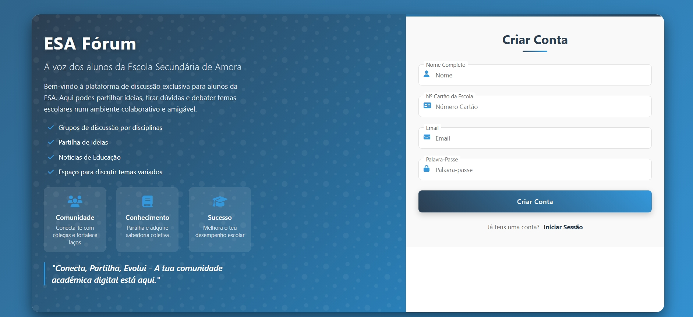
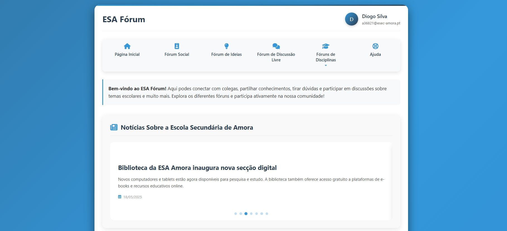
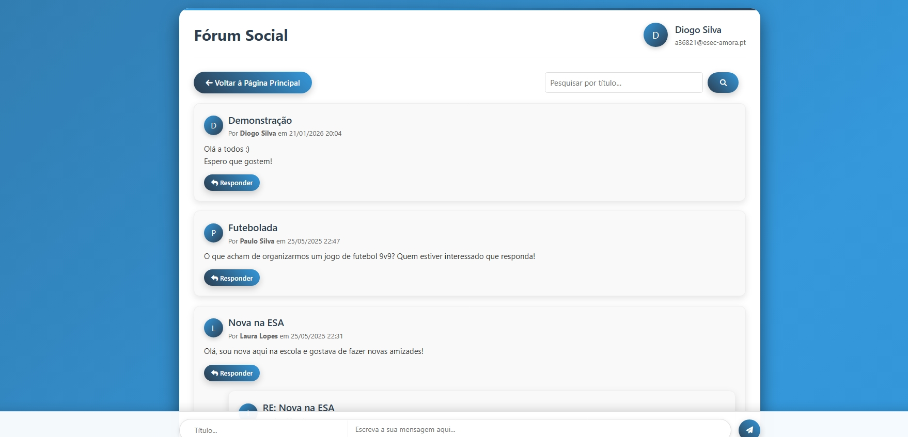
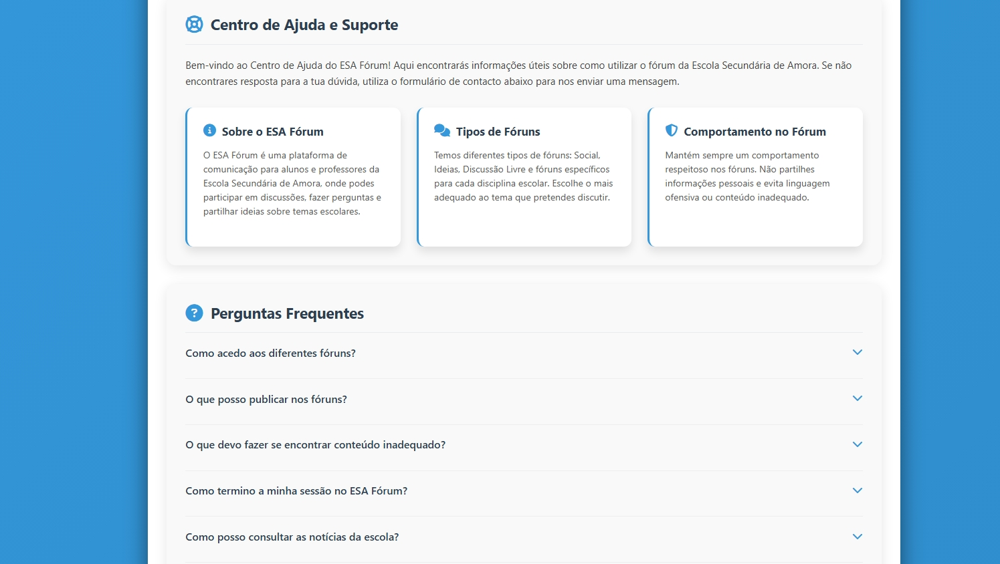

# ESA Fórum

ESA Fórum is a school-focused discussion platform developed as a PAP (Professional Aptitude Project) for secondary school.  
The project was created by a team of three students and is inspired by platforms such as Reddit and Discord, providing a space where students can communicate, share ideas, discuss subjects, and interact with the school community.

---

## Features

- User authentication with institutional school emails only
- Multiple forums separated by categories and subjects
- Social discussion forums
- Idea sharing forums
- Subject-specific discussion areas
- Reply system for forum posts
- Search functionality for posts
- School news section
- Help & support page with FAQ
- Clean and modern UI design

---

## Technologies Used

- **HTML5**
- **CSS3**
- **JavaScript**
- **PHP**
- **XAMPP** (Apache + MySQL local server)

## Screenshots

### Login Page

### Main Page

### Social Forum

### Help Center

---

## Authentication System

The platform only allows registration/login using official institutional school emails in order to maintain a secure and exclusive environment for students and teachers.

Example:

@student-school.pt

## Objective

The main goal of this PAP project was to create a modern communication platform dedicated to the school community, encouraging collaboration, discussion, and information sharing between students and teachers.

This project was Developed by a group of 3 (Me, Gonçalo and Dinis) students as a PAP (Professional Aptitude Project) that acts as a final project of our high school course.
